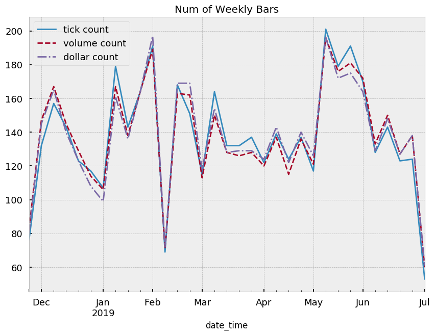

---
layout : default
title:  "7.11"
date:   2019-07-11 17:30:00
---

## 2-1

## (b) count the number of bars produced by tick, volume, and dollar bars on a weekly basis. Plot a time series of that bar count. What bar type produces the most stable weekly count? Why?

### size 200 근방


```python
fig, ax = plt.subplots(1)
weekly_tick_count.dropna().plot(ax=ax)
weekly_vol_count.dropna().plot(ax=ax)
weekly_dollar_count.dropna().plot(ax=ax)
ax.legend(["tick", "vol", 'dollar'])

print(weekly_tick_count.dropna().std(),
weekly_vol_count.dropna().std(),
weekly_dollar_count.dropna().std())
```

    7.765136733171444 7.338926930066035 7.287650409072082
    


## std : tick > vol > dollar

### size 4551 고정


```python
fig, ax = plt.subplots(1)
weekly_tick_count.dropna().plot(ax=ax)
weekly_vol_count.dropna().plot(ax=ax)
weekly_dollar_count.dropna().plot(ax=ax)
ax.legend(["tick", "vol", 'dollar'])

print(weekly_tick_count.dropna().std(),
weekly_vol_count.dropna().std(),
weekly_dollar_count.dropna().std())f,ax=plt.subplots(figsize=(10,7))

t_count.plot(ax=ax, ls='-', label='tick count')
v_count.plot(ax=ax, ls='--', label='volume count')
d_count.plot(ax=ax, ls='-.', label='dollar count')

ax.set_title('Num of Weekly Bars')
ax.legend()
```


    <matplotlib.legend.Legend at 0x7f1a65207400>





```python
display(temp_tick.index.size)
display(temp_volume.index.size)
display(temp_dollar.index.size)

temp_tick = pd.read_csv('tick_t3500_d30.csv',index_col='timestamp')
temp_volume = pd.read_csv('volume_t20000_d30.csv',index_col='timestamp')
temp_dollar = pd.read_csv('dollar_t5300000_d30.csv',index_col='timestamp')

temp_tick['return'] = temp_tick['close'].pct_change()
temp_volume['return'] = temp_volume['close'].pct_change()
temp_dollar['return'] = temp_dollar['close'].pct_change()

temp_tick = temp_tick.dropna()
temp_volume = temp_volume.dropna()
temp_dollar = temp_dollar.dropna()

display(np.std(temp_tick['return']))
display(np.std(temp_volume['return']))
display(np.std(temp_dollar['return']))
```


    1495


    1526


    1585


    0.002731362985818454


    0.002676956326507148


    0.002670536372875379


거의 차이가 안나지만 dollar bar의 std가 낮다

결론 : dollar bar가  stable (stable을 Standard deviation 이 낮다로 판단)

+ bar의 수가 클수록 std가 낮아지는 데, bar 종류별로 bar 숫자를 맞춰서 std를 비교하였다.

Q. bar의 숫자를 맞춰서 비교하는 것이 어떤 역할을 하는가?  
+ 통계적 성질을 비교하기 쉽게해준다. 
+ 각 bar 에서 동일한 수량의 정보를 가져와서 그 정도를 비교

## (c) Compute the serial correlation of returns for the three bar types. What bar method has the lowest serial correlation?

type|threshold|size|autocorr
---|---|---|---
tick|1,000|696|-0.01
tick|1,500|430|0.02
tick|2,000|343|-0.02
tick|10,000|134|-0.04
tick|20,000|62|-0.008
volume|5,000|863|0.001
volume|10,000|429|0.02
volume|20,000|207|-0.08
volume|40,000|98|0.08
volume|60,000|63|-0.03
dollar|500,000|2267|-0.02
dollar|1,000,000|1161|-0.005
dollar|2,000,000|577|0.04
dollar|4,000,000|281|-0.03
dollar|6,000,000|186|-0.02

type|threshold|size|autocorr
---|---|---|---
tick|1,000|696|-0.01027964875388183
volume|5,000|863|0.0011095931056040364
dollar|2,000,000|577|0.036984768684528824

### size가 다를 경우 size 가 클 수록 낮은 autocorr을 보인다.


```python
autocorrs = get_test_stats(bar_types,bar_returns,pd.Series.autocorr)
display(autocorrs.sort_values('autocorr_stat'),
        autocorrs.abs().sort_values('autocorr_stat'))
```


<div>
<style scoped>
    .dataframe tbody tr th:only-of-type {
        vertical-align: middle;
    }

    .dataframe tbody tr th {
        vertical-align: top;
    }

    .dataframe thead th {
        text-align: right;
    }
</style>
<table border="1" class="dataframe">
  <thead>
    <tr style="text-align: right;">
      <th></th>
      <th>sample_size</th>
      <th>autocorr_stat</th>
    </tr>
  </thead>
  <tbody>
    <tr>
      <th>df_raw</th>
      <td>5256742.0</td>
      <td>-0.314554</td>
    </tr>
    <tr>
      <th>dollar</th>
      <td>4550.0</td>
      <td>-0.007240</td>
    </tr>
    <tr>
      <th>tick</th>
      <td>4550.0</td>
      <td>-0.000223</td>
    </tr>
    <tr>
      <th>volume</th>
      <td>4550.0</td>
      <td>0.001190</td>
    </tr>
  </tbody>
</table>
</div>


<div>
<style scoped>
    .dataframe tbody tr th:only-of-type {
        vertical-align: middle;
    }

    .dataframe tbody tr th {
        vertical-align: top;
    }

    .dataframe thead th {
        text-align: right;
    }
</style>
<table border="1" class="dataframe">
  <thead>
    <tr style="text-align: right;">
      <th></th>
      <th>sample_size</th>
      <th>autocorr_stat</th>
    </tr>
  </thead>
  <tbody>
    <tr>
      <th>tick</th>
      <td>4550.0</td>
      <td>0.000223</td>
    </tr>
    <tr>
      <th>volume</th>
      <td>4550.0</td>
      <td>0.001190</td>
    </tr>
    <tr>
      <th>dollar</th>
      <td>4550.0</td>
      <td>0.007240</td>
    </tr>
    <tr>
      <th>df_raw</th>
      <td>5256742.0</td>
      <td>0.314554</td>
    </tr>
  </tbody>
</table>
</div>


### size를 맞췄을 때, tick이 가장 낮은 autocorr을 보임


```python
 bar_seq(daily,3500,20000,5300000)
```

    size of tick 192
    size of volume 207
    size of dollar 211
    


    -0.012984681968585701


    -0.08347302108554866


    -0.11257913902427771


### size를 맞췄을 때, tick bar 가 가장 낮은 autocorr을 보임.

Autocorr 이 낮다는 것의 의미는? 
+ 남들이 모르는 정보를 얻을 수 있는 가능성이 높다. 
+ 자기상관도가 높다는거는 public info 가 너무 많아서 깨끗한 정보를 얻기 어렵다.

자기상관도가 낮을수록 예측할 때 더 좋음. Why? 
+ 통계학적으로도 unbiased 는 얻을 수 있지만 분산이 높아서 inefficient

VS. Information driven bar 이므로 time domain에서의 autocorr과는 해석을 달리해야하지 않을까?

## (d) Partition the bar series into monthly subsets. Compute the variance of returns for every subset of evert bar type. Compute the variance of those variances. What method exhibits the smallest variance of variances?


```python
display(list_var)

tick_var=[]
volume_var=[]
dollar_var=[]
for i in list_var:
    tick_var.append(i[0])
    volume_var.append(i[1])
    dollar_var.append(i[2])
    
tick_varvar = np.var(tick_var)
volume_varvar = np.var(volume_var)
dollar_varvar= np.var(dollar_var)

display(tick_varvar)
display(volume_varvar)
display(dollar_varvar)
```


    [[8.104825352395243e-06, 6.109450767545803e-06, 6.711668602123539e-06],
     [9.871254328271289e-06, 1.0040492385521104e-05, 1.055165194931652e-05],
     [6.284438967754881e-06, 6.570345407339116e-06, 6.101340779508397e-06],
     [6.185833778688405e-06, 5.720799653468178e-06, 4.985283621103247e-06],
     [7.653480310986125e-06, 7.414514210434003e-06, 7.719949513905903e-06],
     [5.003557023965887e-06, 4.242073271549313e-06, 4.414483401157231e-06],
     [7.68002319605474e-06, 7.860018571124206e-06, 7.819664965535925e-06],
     [6.344910373501795e-06, 5.602726322006085e-06, 5.616807857099982e-06],
     [1.0101968262744611e-05, 6.7801771655493584e-06, 7.928329891342995e-06]]


    2.619762526439006e-12


    2.3990126246512785e-12


    3.118552672498244e-12


### Variance of Variances : Dollar > Volume > Tick

##  (e) Apply the Jarque-Bera normality test on returns from the three bar types. What method achieves the lowest test statistics?

the Jarque–Bera test is a goodness-of-fit test of whether sample data have the skewness and kurtosis matching a normal distribution.


```python
s = '\n'
print("jarque bera statistics : ", s,"time bar: ",jtime,s, "tick bar: ", jt,s,"volume bar: " ,jv,s,"dollar bar: " , jd)
```

    jarque bera statistics :  
     time bar:  1306.7836832649127 
     tick bar:  296.2614583137286 
     volume bar:  440.5849195231698 
     dollar bar:  332.9022801952187
    

### time  > volume > dollar > tick

type|threshold|size|autocorr
---|---|---|---
tick|1,000|696|-0.01
volume|5,000|863|0.001
dollar|2,000,000|577|0.04


```python
temp_tick = pd.read_csv('tick_t1000_d30.csv',index_col='timestamp')
temp_volume = pd.read_csv('volume_t5000_d30.csv',index_col='timestamp')
temp_dollar = pd.read_csv('dollar_t2000000_d30.csv',index_col='timestamp')

temp_tick['return'] = temp_tick['close'].pct_change()
temp_volume['return'] = temp_volume['close'].pct_change()
temp_dollar['return'] = temp_dollar['close'].pct_change()

temp_tick = temp_tick.dropna()
temp_volume = temp_volume.dropna()
temp_dollar = temp_dollar.dropna()

fig, ax = plt.subplots()
sns.kdeplot(temp_tick['return'], color="green", label='tick')
sns.kdeplot(temp_volume['return'],  color="red", label='volume')
sns.kdeplot(temp_dollar['return'], color="blue", label='dollar')
plt.show()

fig, ax = plt.subplots()
temp_tick['norm'] = (temp_tick['return']-np.mean(temp_tick['return']))/np.std(temp_tick['return'])
temp_volume['norm'] = (temp_volume['return']-np.mean(temp_volume['return']))/np.std(temp_volume['return'])
temp_dollar['norm'] =(temp_dollar['return']-np.mean(temp_dollar['return']))/np.std(temp_dollar['return'])

sns.kdeplot(temp_tick['norm'], color="green", label='tick')
sns.kdeplot(temp_volume['norm'],  color="red", label='volume')
sns.kdeplot(temp_dollar['norm'], color="blue", label='dollar')
plt.show()
```


```python
from scipy.stats import jarque_bera


jb_value_tick, _ = jarque_bera(temp_tick['return'])
jb_value_vol, _ = jarque_bera(temp_volume['return'])
jb_value_dollar, _ = jarque_bera(temp_dollar['return'])

jb_test_df = pd.DataFrame(data={'jarque_bera_results' : [jb_value_tick,  
                                                         jb_value_vol,
                                                         jb_value_dollar]
                               },
                          index=['tick', 'vol', 'dollar'])
jb_test_df
```


<div>
<style scoped>
    .dataframe tbody tr th:only-of-type {
        vertical-align: middle;
    }

    .dataframe tbody tr th {
        vertical-align: top;
    }

    .dataframe thead th {
        text-align: right;
    }
</style>
<table border="1" class="dataframe">
  <thead>
    <tr style="text-align: right;">
      <th></th>
      <th>jarque_bera_results</th>
    </tr>
  </thead>
  <tbody>
    <tr>
      <th>tick</th>
      <td>22369.407159</td>
    </tr>
    <tr>
      <th>vol</th>
      <td>41928.631421</td>
    </tr>
    <tr>
      <th>dollar</th>
      <td>12760.358808</td>
    </tr>
  </tbody>
</table>
</div>


### tick  > volume > dollar 


```python
s = '\n'
print("jarque bera statistics : ", s,"time bar: ",jtime,s, "tick bar: ", jt,s,"volume bar: " ,jv,s,"dollar bar: " , jd)from scipy.stats import jarque_bera


jb_value_tick, _ = jarque_bera(temp_tick['return'])
jb_value_vol, _ = jarque_bera(temp_volume['return'])
jb_value_dollar, _ = jarque_bera(temp_dollar['return'])

jb_test_df = pd.DataFrame(data={'jarque_bera_results' : [jb_value_tick,  
                                                         jb_value_vol,
                                                         jb_value_dollar]
                               },
                          index=['tick', 'vol', 'dollar'])
jb_test_dfdef jb(x,test=True): 
    np.random.seed(12345678)
    if test: return stats.jarque_bera(x)[0]
    return stats.jarque_bera(x)[1]

get_test_stats(bar_types,bar_returns,jb).sort_values('jb_stat')
```


<div>
<style scoped>
    .dataframe tbody tr th:only-of-type {
        vertical-align: middle;
    }

    .dataframe tbody tr th {
        vertical-align: top;
    }

    .dataframe thead th {
        text-align: right;
    }
</style>
<table border="1" class="dataframe">
  <thead>
    <tr style="text-align: right;">
      <th></th>
      <th>sample_size</th>
      <th>jb_stat</th>
    </tr>
  </thead>
  <tbody>
    <tr>
      <th>dollar</th>
      <td>4550.0</td>
      <td>3.670098e+04</td>
    </tr>
    <tr>
      <th>volume</th>
      <td>4550.0</td>
      <td>3.891609e+04</td>
    </tr>
    <tr>
      <th>tick</th>
      <td>4550.0</td>
      <td>4.526845e+04</td>
    </tr>
    <tr>
      <th>df_raw</th>
      <td>5256742.0</td>
      <td>1.141607e+12</td>
    </tr>
  </tbody>
</table>
</div>


### 대부분의 지표들이 Tick 아니면 Dollar가 우세하다.

## 2.2 On series of 'Data', compute dollar bars and dollar imbalance bars. What bar type exhibits greater serial correlation? Why?


```python
re_dib = returns(dib.close)

dollar_get = [re_db, re_dib]
dollar_types = ['volume var', 'v_imbalance']
autocorrs = get_test_stats(dollar_types,dollar_get, pd.Series.autocorr)
display(autocorrs.sort_values('autocorr_stat'),
        autocorrs.abs().sort_values('autocorr_stat'))
```


<div>
<style scoped>
    .dataframe tbody tr th:only-of-type {
        vertical-align: middle;
    }

    .dataframe tbody tr th {
        vertical-align: top;
    }

    .dataframe thead th {
        text-align: right;
    }
</style>
<table border="1" class="dataframe">
  <thead>
    <tr style="text-align: right;">
      <th></th>
      <th>sample_size</th>
      <th>autocorr_stat</th>
    </tr>
  </thead>
  <tbody>
    <tr>
      <th>volume var</th>
      <td>4550.0</td>
      <td>-0.007240</td>
    </tr>
    <tr>
      <th>v_imbalance</th>
      <td>75905.0</td>
      <td>-0.004979</td>
    </tr>
  </tbody>
</table>
</div>


<div>
<style scoped>
    .dataframe tbody tr th:only-of-type {
        vertical-align: middle;
    }

    .dataframe tbody tr th {
        vertical-align: top;
    }

    .dataframe thead th {
        text-align: right;
    }
</style>
<table border="1" class="dataframe">
  <thead>
    <tr style="text-align: right;">
      <th></th>
      <th>sample_size</th>
      <th>autocorr_stat</th>
    </tr>
  </thead>
  <tbody>
    <tr>
      <th>v_imbalance</th>
      <td>75905.0</td>
      <td>0.004979</td>
    </tr>
    <tr>
      <th>volume var</th>
      <td>4550.0</td>
      <td>0.007240</td>
    </tr>
  </tbody>
</table>
</div>


Imbalance bar의 auto corr이 낮다

Q. 왜 serial correlation 을 계산하라고 했을까?
Dollar bar와 dollar imbalance bar의 의미 차이는 무엇일까?

Dollar bar 는 거래대금이 발생했을 때 샘플링
Dollar imbalance bar 는 거래대금이 특정방향으로 기대치 이상으로 발생하였을 때 샘플링


## 2.4 (a) Compute Bollinger bands of width 5% around a rolling moving average. Count how many times prices cross the bands out (from within the bands to outside the bands)


```python
bb.plot()
```


    <matplotlib.axes._subplots.AxesSubplot at 0x7f7bfbe770b8>


```python
len(bb[bb.price > bb.upper_band]) + len(bb[bb.price < bb.lower_band])
```


    1


```python
from mlfinlab import filters
mlfinlabcusum = filters.cusum_filter(db2.price, 0.05)
len(mlfinlabcusum)
```


    8


```python
plt.plot(db['price'])
plt.plot(mbb)
plt.plot(ubb)
plt.plot(lbb)
plt.show()

```


```python
cross_count=0
for i in range(0, len(db['price'])):
  if db['price'][i] - ubb[i] >= 0 and db['price'][i-1] - ubb[i-1] < 0:
    cross_count += 1
  if db['price'][i] - lbb[i] < 0 and db['price'][i-1] - lbb[i-1] >= 0:
    cross_count += 1
cross_count


```


    30


### (c) 

+ 현재 샘플링된 데이터가 너무 적다. 필터의 폭을 좁혀서 해보자.

### Note

Imbalance bar 를 만드는 마지막 식이  

$\text{arg } \text{min} \{  |\theta_t| \geq E_0[T] \mid 2P[b_t = 1] -1 \mid \} $. 인데  

책에서는 'in practice'   $ E_0[T]$ 를 T 의 ewma 로 $2P[b_t = 1] -1$ 를 b 의 ewma로 구한다고 하였다.  

$2P[b_t = 1] -1$ 는 실제값을 구할 수 있을 거 같은데, 왜 근사하는 값은 사용한 것일까? 왜 근사하는 걸까?


```python

```
